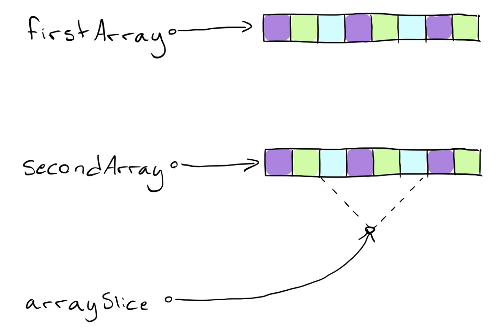

# Array

Arrays are stored as a contiguous block in memory. That means if you have ten elements in an array, the ten values are all stored one next to the other. With that in mind, here’s the performance cost of various array operations:
### Accessing elements
 The cost of fetching an element is cheap, meaning that it happens in a fixed or constant time. Sometimes this is written O(1). Since all the values are sequential, it’s easy to use random access and fetch a value at a particular index; all the compiler needs to know is where the array starts and what index you want to fetch.
### Inserting elements
 The complexity of adding an element depends on the position in which you add the new element:
• If you add to the beginning of the array, Swift requires time proportional to the size of the array because it has to shift all of the elements over by one to make room. This is called linear time and sometimes written O(n).
• Likewise, if you add to the middle of the array, all values from that index on need to be shifted over. Doing so will require n/2 operations, therefore the running time is still linear with the size of the array or O(n).
• If you add to the end of the array using append and there’s room, it will take O(1). If there isn’t room, Swift will need to make space somewhere else and copy the entire array over before adding the new element, which will take O(n). The average case is O(1) though because arrays are not full most of the time.
### Deleting elements
 Deleting an element leaves a gap where the removed element was. All elements in the array have to be sequential, so this gap needs to be closed by shifting elements forward.
The complexity is similar to inserting elements: If you’re removing an element from the end, it’s an O(1) operation. Otherwise, the complexity is O(n).
### Searching for an element
 If the element you’re searching for is the first element in the array, then the search will end after a single operation. If the element doesn’t exist, you need to perform N operations until you realize that the element is not found. On average, searching for an element will take n/2 operations; therefore searching has a complexity of O(n).
As you learn about dictionaries and sets, you’ll see how their performance characteristics differ from arrays. That could give you a hint on which collection type to use for your particular case.

## Array performance: reserveCapacity()
* [Hackingwithswift](https://www.hackingwithswift.com/articles/128/array-performance-append-vs-reservecapacity)


# ArraySlice
`<ArraySlice>` is a generic struct that very much behaves like an array. It supports much of the same functionality that the `<Array>` does, so working with it feels very familiar.
What makes the `<ArraySlice>` special is its capability of free-riding on part of an array’s already allocated memory space. You can visualize it like this:



As you can see, the two arrays each allocates their own space in memory, and keep their own, separate copies of their elements, even though they may be the same.
The ArraySlice on the other hand, can reference part of another array’s memory and pass it off as its own, effectively eliminating duplication of values.
An ArraySlice is perfectly capable of allocating its own memory space if needed, but then you kind of lose the whole point of using them at all.

let’s take a moment to recognize that an instance of `<ArraySlice>` will actually increase the reference counter for the underlying storage of the array. Because of this, it is never a good idea to store a slice for longer than you absolutely need to, since it will keep the whole memory space from being deallocated if the array is deallocated before our array slice (that means the whole memory space, not just a few elements that the slice may be referencing).

### Example of ArraySlice
```swift
var array = [1, 2, 3, 4, 5]
let slice = array[1...3]
print(slice)
// Prints [2, 3, 4]
```
`<Array>` and `<ArraySlice>` share many similarities
```swift
let sum = slice.reduce(0, +)
print(sum)
// Prints 9
```
```swift
let max = slice.max()
print(max)
// Prints Optional(4)
```

But There is catch
```swift
for index in 0 ..< slice.count {
    print(slice[index])
}
// Fatal error: Index out of bounds
```
This is actually a pretty interesting detail to know about the ArraySlice. Since it references another arrays memory space, it also borrows the indices from that array. So the indices of our slice don’t range from 0 through 2, they actually range from 1 through 3!
We can fix this
```swift
for index in slice.startIndex ..< slice.endIndex {
    print(slice[index])
}
// Prints 2 3 4
```
One thing to note about the `<.endIndex>` property is that it actually references the first offset after the array ends, which means you will get an Index Out Of Bounds error if you try to access the element in that location. Therefore, use the half-open range operator (`<..<>`) when forming the index range you want to use.
